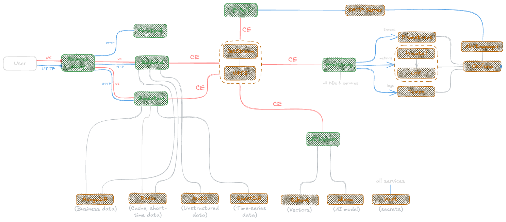

# Architecture

We have decided to adopt a microservices architecture for our application. 
Inter-service communication will primarily use HTTP/REST or CloudEvents/NATS, while asynchronous messaging will be explored for cases that benefit from decoupling and eventual consistency. 
Services will manage their own databases or schemas to ensure loose coupling and domain ownership. 
To support this architecture, we will containerize each service using Docker and orchestrate them locally using Docker Compose, with the option to explore Kubernetes if time permits. 
Additionally, we will implement basic observability features such as health checks, centralized logging, and monitoring, and we will set up CI/CD pipelines using GitHub Actions to support automated testing and deployment.

To get the reasons for each decision, please read the [Architecture Decision Records](adr/adr.md).

## Overview

